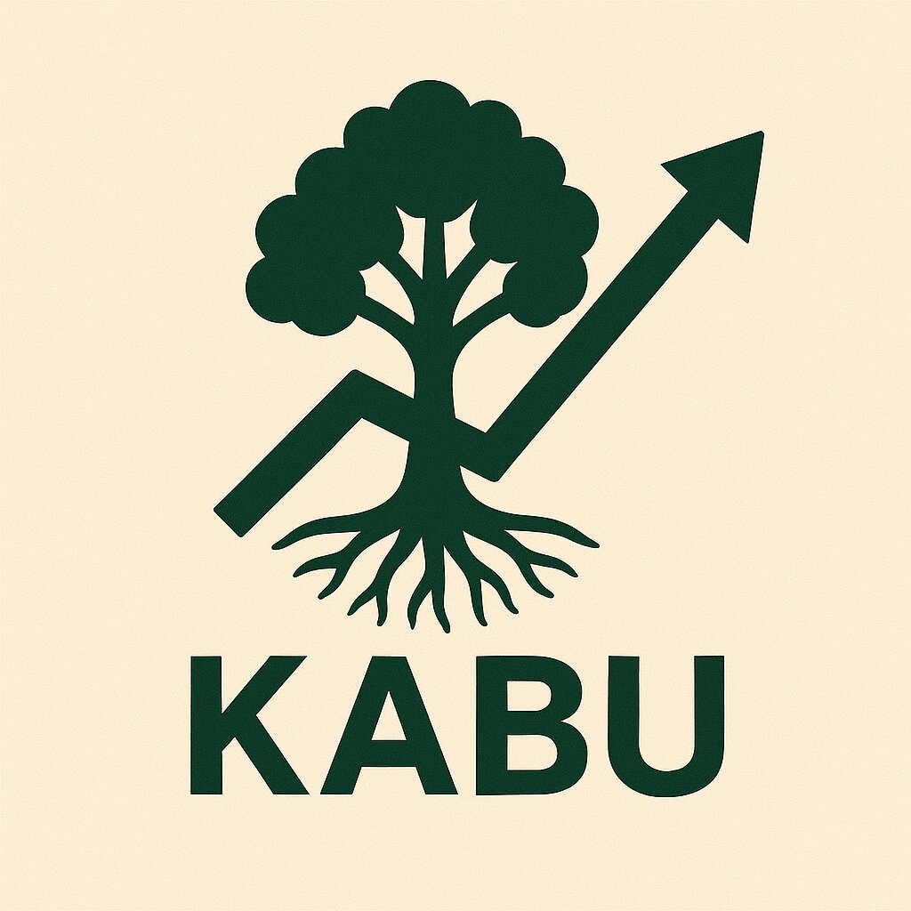

# Kabu

<div align="center">



[][gh-kabu]
[][gh-book]
[![Telegram Chat][tg-badge]][tg-url]

| [User Book](https://cakevm.github.io/kabu/)
| [Crate Docs](https://cakevm.github.io/kabu/docs/) |

[gh-kabu]: https://github.com/cakevm/kabu/actions/workflows/ci.yml
[gh-book]: https://github.com/cakevm/kabu/actions/workflows/book.yml
[tg-badge]: https://img.shields.io/badge/telegram-kabu-2C5E3D?style=plastic&logo=telegram
[tg-url]: https://t.me/joinkabu

</div>

> ⚠️ **WARNING: This codebase is under heavy development and far from ready for production use.** 
> 
> The code is currently being actively refactored and modernized. Many features are incomplete, broken, or subject to breaking changes without notice. It is a long road from custom types to reth node types and using all providers from reth. With limited time, it will take a while. In the meantime, feel free to join the [Telegram group](https://t.me/joinkabu) for discussion.

## What is Kabu?

Kabu is a backrunning bot, currently under heavy development. It continues the journey of [loom](https://github.com/dexloom/loom). Since then many breaking changes have been made to revm, reth and alloy. The goal here is to make everything work again and modernize the codebase. Currently, Kabu is a work in progress and not yet ready for production use.

## Who is Kabu for?

For everyone that does not like to reinvent the wheel all the time. Have foundation to work with, extend it, rewrite it or use it as playground to learn about MEV and backrunning.


## Kabu is opinionated
- Kabu will only support node (reth embedded) and remote (json-rpc).
- We reuse as much as possible from reth, alloy and revm

## Roadmap
- Remove `KabuDataTypes` ✅
- Remove `Actor` model and use trait based components like in reth  ✅
- Remove topology and simplify the config / codebase  ✅
- Refactor the extra db pool cache layer to make it optional 🛠️
- Have components that can be replaced with custom implementations 🛠️
- Make complex arb strategies work

## Kabu contract
Find the Kabu contract [here](https://github.com/cakevm/kabu-contract).

## Why "Kabu"?

In Japanese, *kabu* (株) means "stock" — both in the financial sense and as a metaphor for growth.

## Setup

### Prerequisites

- Rust
- Optional: PostgreSQL (for database)
- Optional: InfluxDB (for metrics)
- RPC node (e.g. your own node)

### Building Kabu
```bash
# Development build
make
# Release build (optimized)
make release
# Maximum performance build
make maxperf
```

### Configuration

Kabu supports two modes:
- **Remote mode**: Connect to an external Reth or Geth node via RPC
- **Node mode**: Run with reth embedded with direct access to node internals and db [PREFERRED]


## Acknowledgements

Many thanks to [dexloom](https://github.com/dexloom)! This project is a hard-fork from [loom](https://github.com/dexloom/loom), based on this [branch](https://github.com/dexloom/loom/tree/entityid). The `flashbots` crate is fork of [ethers-flashbots](https://github.com/onbjerg/ethers-flashbots). The `uniswap-v3-math` crate is a fork of [uniswap-v3-math](https://github.com/0xKitsune/uniswap-v3-math). Additionally, some code for the Uniswap V3 pools is derived from [amms-rs](https://github.com/darkforestry/amms-rs). Last but not least, a big shoutout to [Paradigm](https://github.com/paradigmxyz) — without their work, this project would not have been possible.

## License
This project is licensed under the [Apache 2.0](./LICENSE-APACHE) or [MIT](./LICENSE-MIT). 